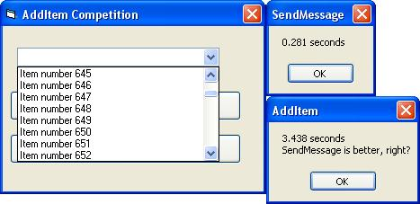



## A Faster AddItem

### Description

My third subbmission in one day heh... I am just board, so I made a little competition AddItem vs. SendMessage. So, I found that SendMessage is about 2 times faster than VB's add item. Microsoft, can you mak2e our lives easier and just give us working functions???
 
### More Info
 

             |
---                |---
**Submitted On**   |2003-08-08 13:44:40
**By**             |[dsmfdsjfnhdksfjdsk](https://github.com/Planet-Source-Code/PSCIndex/blob/master/ByAuthor/dsmfdsjfnhdksfjdsk.md)
**Level**          |Intermediate
**User Rating**    |5.0 (20 globes from 4 users)
**Compatibility**  |VB 4\.0 \(32\-bit\), VB 5\.0, VB 6\.0
**Category**       |[Coding Standards](https://github.com/Planet-Source-Code/PSCIndex/blob/master/ByCategory/coding-standards__1-43.md)
**World**          |[Visual Basic](https://github.com/Planet-Source-Code/PSCIndex/blob/master/ByWorld/visual-basic.md)
**Archive File**   |[A\_Faster\_A162630882003\.zip](https://github.com/Planet-Source-Code/dsmfdsjfnhdksfjdsk-a-faster-additem__1-47523/archive/master.zip)

